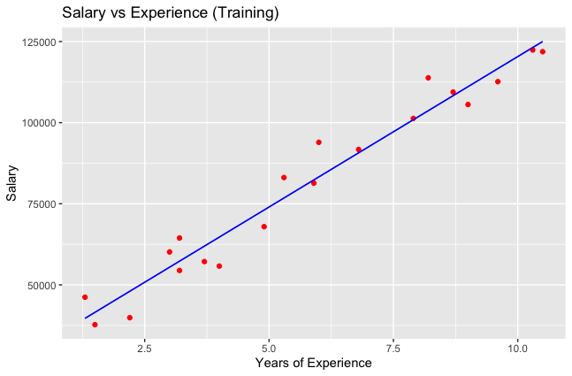
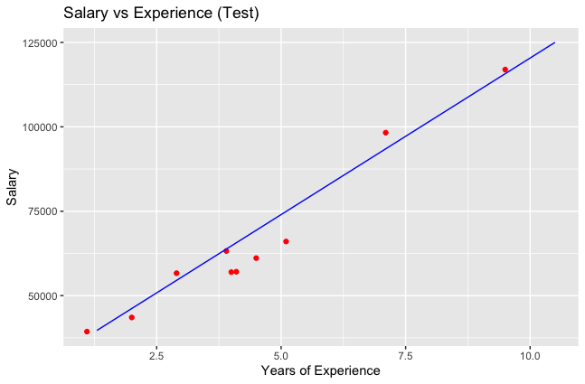

# Simple_Linear_Regression

## Model

```
Y = b0 + b1X + e
```

## Minimising Least Squares

Minimising least squares is one of the most common approaches for getting b, i.e the regression coefficients that generate the line/model that best fits the data points. In other words, we minimise the sum of residuals (difference between response value and predicted reponse).

## Get the Data

**data = read.csv("Salary_Data.csv")**

## Split the Data into Training and Test

Splits are really as you prefer but a good standard is 80% for training and 20% for testing. However, since our data set only has 30 observations I am going to split it 2:3 so 20 for training and 10 for testing.

**split = sample.split(data$Salary, SplitRatio = 2/3)**  
**training = subset(data, split == TRUE)**  
**test = subset(data, split == FALSE)**

## Fitting Simple Linear Regression Model to Training Data

**regressor = lm(formula = Salary ~ YearsExperience, data = training)**

The lm function is used to fit linear models.

Parameters:

1. Formula parameter describes the model.  

Note that the formula argument follows a specific format. For simple linear regression, this is “YVAR ~ XVAR” where YVAR is the dependent, or predicted, variable and XVAR is the independent, or predictor, variable.

2. Data set.

To get a summary of the regressor model:

**summary(regressor)**

this will give you details about the residuals, coefficients, R-squared etc of the model. The number of stars in the coefficient sections acts as a rating on how statistically significant a variable is, with three stars being highly statistically significant and no stars being not statistically significant.

## Predicting the Test Results

**y_pred = predict(regressor, newdata = test)**

Parameters:

1. The model, in our case the regressor.
2. New data set, i.e. the test data set.

## Visualising the Model Results

**install.packages("ggplot2")**  
**library(ggplot2)**

**plot = ggplot()**  
**plot + geom_point(aes(x = training$YearsExperience, y = training$Salary), colour = "red") + geom_line(aes(x = training$YearsExperience, y = predict(regressor, newdata = training)), colour = "blue")**  
**plot + ylab("Salary") + xlab("Years of Experience") + ggtitle("Salary vs Experience (Training)")** 
  
The geom_point function is used to create scatterplots and the aes, i.e. aesthetics, function is used to specify the x and y axis data and the colour of the plots. 

The geom_line function is used to generate the line and notice we use the y axis as the regression predictor based on the training data rather than the test data this time.

The other ylab, xlab and ggtitle functions are for labelleling.



## Plotting Against the Test Data Set

**testPlot = ggplot()**  
**testPlot + geom_point(aes(x = test$YearsExperience, y = test$Salary), colour = "red") + geom_line(aes(x = training$YearsExperience, y = predict(regressor, newdata = training)), colour = "blue")**  
**testPlot + ylab("Salary") + xlab("Years of Experience") + ggtitle("Salary vs Experience (Test)")** 

Notice the only difference is that for the geomn_line we obviously use the trained model from the training data and not create a new model based on the test data set.



